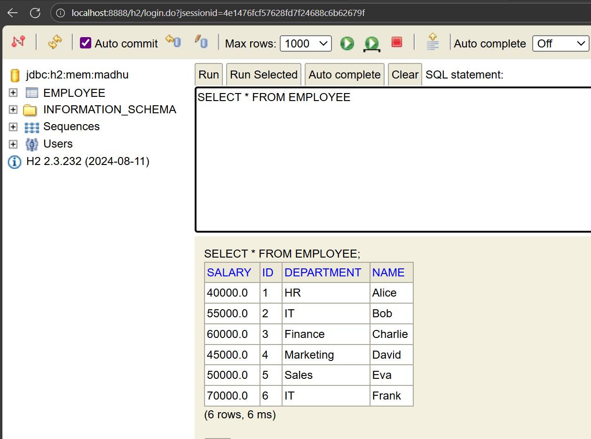
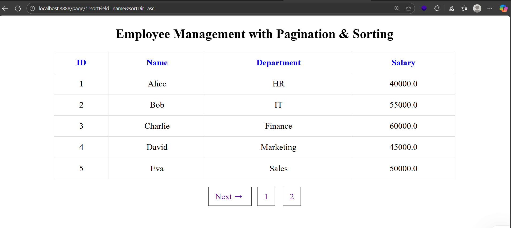
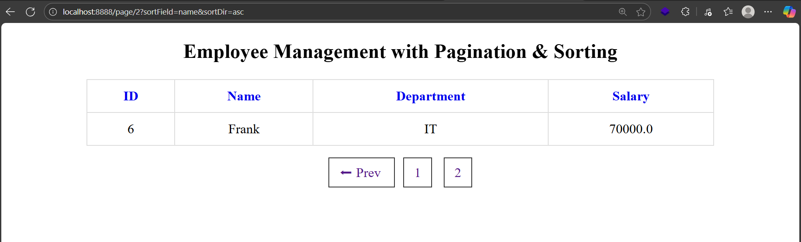

# Employee Management System

A simple **Spring Boot + Spring Data JPA + Thymeleaf** application to manage employees with **pagination and sorting** features.  
This project demonstrates CRUD operations, pagination, and server-side sorting in a clean MVC architecture.

---

## 🚀 Features
- Add and save employee details
- View employees in a paginated table
- Sort employee records by:
  - **ID**
  - **Name**
  - **Department**
  - **Salary**
- Previous/Next navigation between pages

---

## 🛠️ Tech Stack
- **Backend:** Spring Boot, Spring MVC, Spring Data JPA  
- **Database:** H2 (in-memory) / MySQL (can be configured)  
- **View Layer:** Thymeleaf templating engine  
- **Build Tool:** Maven  
- **Language:** Java (JDK 17 or later)  

<p align="center">
  <a href="https://www.java.com/" target="_blank">
    
  </a>
  <a href="https://spring.io/projects/spring-boot" target="_blank">
    
  </a>
  <a href="https://spring.io/projects/spring-data-jpa" target="_blank">
    
  </a>
  <a href="https://www.thymeleaf.org/" target="_blank">
    
  </a>
  <a href="https://www.mysql.com/" target="_blank">
    
  </a>
  <a href="https://maven.apache.org/" target="_blank">
    
  </a>
</p>
---

## 📂 Project Structure
```text
src/main/java/com/example/
├── entity/Employee.java # JPA Entity
├── repository/EmployeeRepository.java
├── service/EmployeeService.java
└── controller/EmployeeController.java

src/main/resources/templates/
└── employees.html # Thymeleaf view template

images/ # Output screenshots
├── h2db.png
├── frontend1.png
└── frontend2.png
```
---

## 🖼️ Outputs

### 1️⃣  

---

### 2️⃣ 

---

### 3️⃣ 

---
## ▶️ How to Run
1. Clone the repo:
   ```bash
   git clone https://github.com/your-username/employee-management.git
   cd employee-management
   ## ▶️ How to Run
1. Clone the repo:
   ```bash
   git clone https://github.com/your-username/employee-management.git
   cd employee-management
   ## ▶️ How to Run
1. Clone the repo:
   ```bash
   git clone https://github.com/your-username/employee-management.git
   cd employee-management
   ```
Build & run with Maven:
```
mvn spring-boot:run
```
Open in browser: http://localhost:8080/

📌 Future Improvements

Add full CRUD (update & delete)
Implement search functionality
Add REST API endpoints for integration
